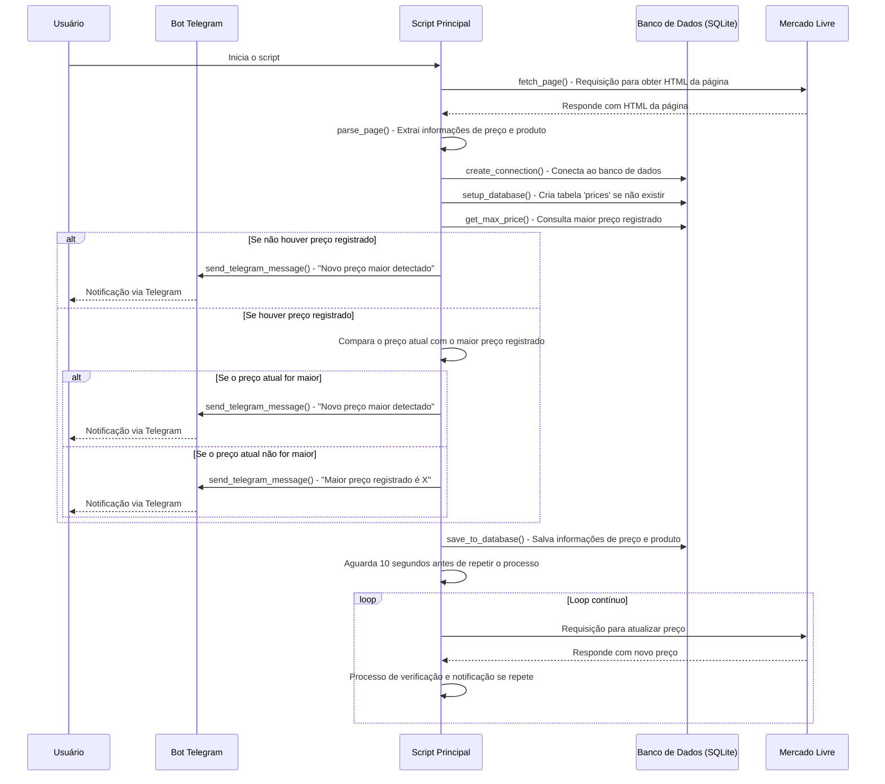

# IphoneWebScrapingAovivo
 
<p align="center">
  <a href="https://suajornadadedados.com.br/"></a>
</p>
<p align="center">
    <em>Nossa missão é fornecer o melhor ensino em engenharia de dados</em>
</p>

Bem-vindo a **Jornada de Dados**

# Monitoramento de Preço com Web Scraping e Notificações no Telegram

Este projeto realiza o monitoramento de preços de produtos em sites de e-commerce. Utilizando técnicas de web scraping, o projeto coleta preços e envia notificações no Telegram quando o valor atinge um limite específico definido pelo usuário. A aplicação é modular, dividida em partes para facilitar o desenvolvimento e a manutenção.

## Esse projeto faz parte do workshop de Web Scraping

Assista ao vídeo completo aqui

[](https://youtube.com/live/z1EOlFV8g7g)

## Arquitetura



## Bibliotecas Utilizadas e Explicação

1. **requests**: Usada para fazer requisições HTTP e obter o HTML das páginas web.
2. **BeautifulSoup (bs4)**: Utilizada para analisar e extrair informações específicas do HTML das páginas, como o preço do produto.
3. **schedule**: Biblioteca para agendar tarefas, permitindo verificar preços em intervalos regulares.
4. **pandas**: Facilita a manipulação de dados, permitindo salvar e carregar históricos de preços em arquivos CSV.
5. **sqlite3**: Um banco de dados SQLite leve, usado para armazenar e organizar dados de preços ao longo do tempo.
6. **python-telegram-bot**: Biblioteca para enviar mensagens ao Telegram, notificando o usuário quando o preço atinge um valor específico.
7. **python-dotenv**: Carrega variáveis de ambiente de um arquivo `.env`, onde são armazenadas informações sensíveis como o token e o chat ID do Telegram.

## Pré-requisitos

1. **Python 3.6+**: Certifique-se de ter o Python 3.6 ou superior instalado.
2. **Dependências**: Instale as bibliotecas listadas no arquivo `requirements.txt`.

Para instalar as dependências, execute o comando:
```bash
pip install -r requirements.txt
```

## Configuração

1. **Configuração do Telegram**: Crie um bot no Telegram usando o BotFather e obtenha o token de autenticação.
2. **Arquivo `.env`**: Crie um arquivo `.env` na raiz do projeto e insira as credenciais do Telegram:
   ```
   TELEGRAM_TOKEN=SEU_TOKEN_DO_TELEGRAM
   TELEGRAM_CHAT_ID=SEU_CHAT_ID
   ```
   - Substitua `SEU_TOKEN_DO_TELEGRAM` com o token do seu bot.
   - Substitua `SEU_CHAT_ID` com o ID do chat onde você deseja receber notificações.

3. **Configuração do Banco de Dados**: O banco de dados SQLite será criado automaticamente na primeira execução.

## Estrutura dos Aplicativos

### `app_1`: Coletor de Dados com `requests`
Esse módulo faz requisições HTTP para acessar o conteúdo HTML das páginas de produtos. Ele coleta o HTML bruto que será processado pelo `app_2`.

### `app_2`: Parser de HTML com `BeautifulSoup`
Esse módulo recebe o HTML do `app_1` e utiliza o `BeautifulSoup` para extrair informações específicas, como o preço atual do produto.

### `app_3`: Agendamento de Tarefas com `schedule`
Esse módulo usa `schedule` para definir a frequência com que o monitoramento de preços é executado. Por exemplo, pode ser configurado para verificar o preço a cada 10 minutos.

### `app_4`: Manipulação de Dados com `pandas`
Esse módulo organiza os dados coletados e pode salvar o histórico de preços em um arquivo CSV para facilitar a análise e o armazenamento.

### `app_5`: Banco de Dados com `sqlite3`
Esse módulo gerencia o banco de dados SQLite, criando tabelas e armazenando informações do histórico de preços.

### `app_6`: Comparação de Preços (`max_price`)
Esse módulo compara o preço atual do produto com o `max_price` definido pelo usuário. Caso o preço esteja abaixo do limite, ele envia uma notificação usando o `app_7`.

### `app_7`: Envio de Notificação com Telegram
Esse módulo utiliza a biblioteca `python-telegram-bot` para enviar uma mensagem ao Telegram informando que o preço atingiu o valor desejado.

## Como Executar

1. **Clone o Repositório**:
   ```bash
   git clone https://github.com/lvgalvao/IphoneProjectWebScraping
   cd IphoneProjectWebScraping
   ```

2. **Instale as Dependências**:
   ```bash
   pip install -r requirements.txt
   ```

3. **Configure o `.env`**:
   - Siga as instruções em "Configuração" e adicione o arquivo `.env` com as variáveis de ambiente para o bot do Telegram.

4. **Execute o Script**:
   ```bash
   python app_8_postgres.py
   ```

O projeto agora iniciará o monitoramento do preço de produtos, verificando em intervalos regulares e notificando o usuário via Telegram caso o preço atinja o valor desejado.

Caso queira fazer um teste local

5. **Execute o Script 6 para um teste local**:
   ```bash
   python app_6.py
   ```

## Migrando para Postgres

Para migrar de SQLite para PostgreSQL, você pode usar a biblioteca `psycopg2` para conectar-se ao banco de dados PostgreSQL. Abaixo está o código atualizado para suportar o PostgreSQL. Vou explicar as mudanças e as etapas adicionais necessárias para configurar o ambiente.

1. Primeiro, instale o `psycopg2`:
   ```bash
   pip install psycopg2-binary
   ```

2. Atualize o arquivo `.env` com as credenciais do PostgreSQL:
   ```env
   TELEGRAM_TOKEN=SEU_TOKEN_DO_TELEGRAM
   TELEGRAM_CHAT_ID=SEU_CHAT_ID
   POSTGRES_DB=nome_do_banco
   POSTGRES_USER=seu_usuario
   POSTGRES_PASSWORD=sua_senha
   POSTGRES_HOST=localhost
   POSTGRES_PORT=5432
   ```

### Alterações Realizadas

- **Substituição do SQLite pelo PostgreSQL**: 
   - O módulo `sqlite3` foi substituído por `psycopg2`, que conecta-se ao PostgreSQL.
   - As variáveis de ambiente foram configuradas para receber as credenciais de conexão ao PostgreSQL.
   
- **Criação da Tabela `prices`**:
   - Utilizamos a sintaxe SQL específica do PostgreSQL para a criação da tabela `prices`.
   
- **Salvamento e Consulta de Dados**:
   - A função `get_max_price` consulta o maior preço registrado até o momento na tabela `prices` do PostgreSQL.
   - `save_to_database` salva o registro atual utilizando um `DataFrame` pandas.

### Observação
Caso deseje simplificar, você pode substituir a função `save_to_database` para um `INSERT` direto ao invés de `pandas.to_sql`, caso tenha dificuldades com integração pandas e PostgreSQL.

## Docker

Aqui estão os comandos para construir e executar o contêiner Docker com o `.env`:

1. **Construir a Imagem Docker**:
   Navegue até o diretório onde o `Dockerfile` está localizado e execute:

   ```bash
   docker build -t app_8 .
   ```

   Esse comando cria uma imagem Docker chamada `app_8` usando o `Dockerfile` atual.

2. **Executar o Contêiner com as Variáveis de Ambiente do `.env`**:
   Para iniciar o contêiner e carregar as variáveis de ambiente do arquivo `.env`, use:

   ```bash
   docker run -d --env-file .env --name app_8_container app_8
   ```

   - `-d`: Executa o contêiner em segundo plano (modo "detached").
   - `--env-file .env`: Carrega as variáveis de ambiente definidas no arquivo `.env`.
   - `--name app_8_container`: Nomeia o contêiner como `app_8_container`.
   - `app_8`: Especifica a imagem que você criou no comando de build.

Esse processo configurará o contêiner para rodar o `app_8.py` com as variáveis de ambiente do `.env`.

## Amazon

Aqui está o passo a passo completo atualizado para configurar uma instância Ubuntu e executar seu projeto Docker, com todos os comandos usando `sudo` para evitar problemas de permissão.

### 1. Conectar à Instância EC2

Conecte-se à sua instância Ubuntu na AWS via SSH:
```bash
ssh -i "seu-arquivo.pem" ubuntu@seu-endereco-ec2
```

### 2. Atualizar o Sistema

Atualize o sistema e os pacotes:
```bash
sudo apt update -y
sudo apt upgrade -y
```

### 3. Instalar Git

Instale o Git para clonar o repositório do projeto:
```bash
sudo apt install git -y
```

### 4. Clonar o Repositório

Clone o repositório do projeto no diretório `/home/ubuntu`:
```bash
sudo git clone https://github.com/lvgalvao/IphoneProjectWebScraping.git
cd IphoneProjectWebScraping
```

### 5. Instalar o Docker

#### 5.1 Instalar Dependências do Docker

Primeiro, instale os pacotes necessários para adicionar o repositório do Docker:
```bash
sudo apt install apt-transport-https ca-certificates curl software-properties-common -y
```

#### 5.2 Adicionar o Repositório Docker

Adicione a chave GPG do Docker e o repositório oficial:
```bash
curl -fsSL https://download.docker.com/linux/ubuntu/gpg | sudo gpg --dearmor -o /usr/share/keyrings/docker-archive-keyring.gpg
echo "deb [arch=amd64 signed-by=/usr/share/keyrings/docker-archive-keyring.gpg] https://download.docker.com/linux/ubuntu $(lsb_release -cs) stable" | sudo tee /etc/apt/sources.list.d/docker.list > /dev/null
```

#### 5.3 Instalar Docker

Atualize novamente os pacotes e instale o Docker:
```bash
sudo apt update -y
sudo apt install docker-ce docker-ce-cli containerd.io -y
```

#### 5.4 Iniciar e Habilitar o Docker

Inicie o Docker e configure-o para iniciar automaticamente ao ligar o sistema:
```bash
sudo systemctl start docker
sudo systemctl enable docker
```

### 6. Configurar o Arquivo `.env` com as Variáveis de Ambiente

No diretório `/home/ubuntu/IphoneProjectWebScraping`, crie o arquivo `.env` para armazenar as variáveis de ambiente necessárias:

```bash
sudo nano .env
```

Dentro do editor `nano`, insira as variáveis de ambiente do projeto:

```dotenv
# Telegram Bot
TELEGRAM_TOKEN=XXX
TELEGRAM_CHAT_ID=XXX

# PostgreSQL Database
POSTGRES_DB=XXX
POSTGRES_USER=XXX
POSTGRES_PASSWORD=XXX
POSTGRES_HOST=XXX
POSTGRES_PORT=XXX
```

Pressione `Ctrl + X` para sair, `Y` para confirmar as alterações e `Enter` para salvar.

### 7. Construir a Imagem Docker

No diretório do projeto, onde o `Dockerfile` está localizado, construa a imagem Docker usando `sudo`:

```bash
sudo docker build -t iphone_project .
```

Esse comando cria uma imagem Docker chamada `iphone_project` com base no `Dockerfile`.

### 8. Executar o Contêiner com o Arquivo `.env`

Agora que a imagem foi construída, execute o contêiner e carregue as variáveis de ambiente do `.env`:

```bash
sudo docker run -d --env-file .env --name iphone_project_container iphone_project
```

Explicação dos parâmetros:
- `-d`: Executa o contêiner em segundo plano.
- `--env-file .env`: Carrega as variáveis de ambiente do arquivo `.env`.
- `--name iphone_project_container`: Nome do contêiner.
- `iphone_project`: Nome da imagem Docker criada.

### 9. Verificar os Logs do Contêiner

Para garantir que o contêiner está rodando corretamente, você pode verificar os logs com:

```bash
sudo docker logs iphone_project_container
```

Esse processo completo deve configurar sua instância Ubuntu com Git e Docker, permitir que você crie o `.env`, e rode o contêiner Docker do seu projeto com todos os comandos usando `sudo`.
